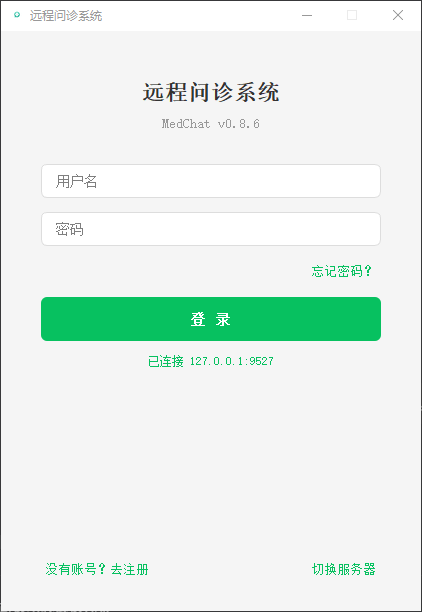
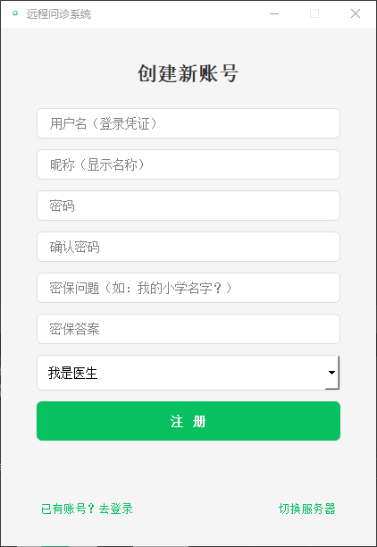
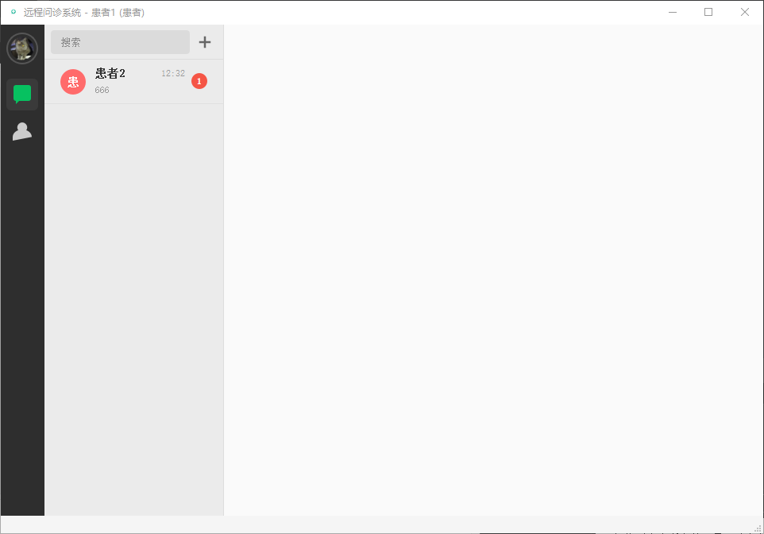
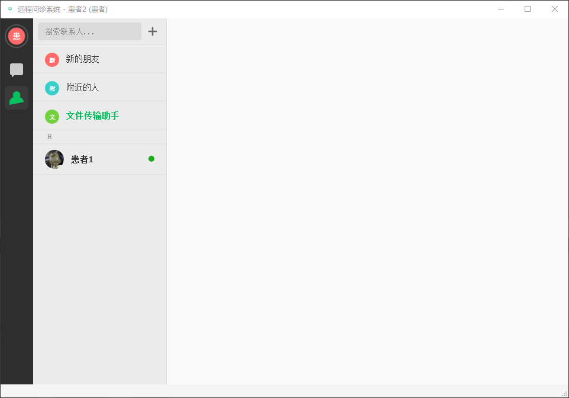
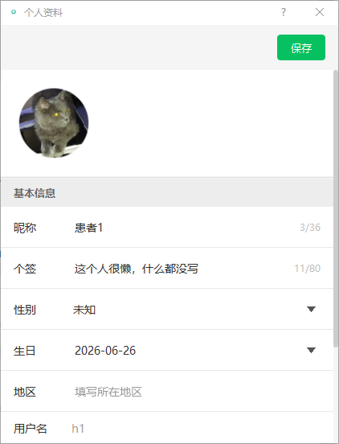
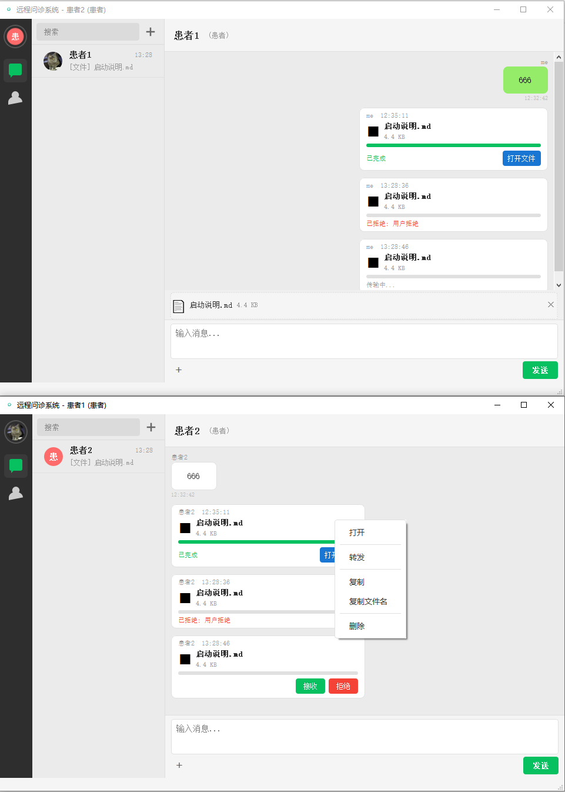

# 🏥 MedChat

<p align="center">
  
</p>

<p align="center">
  <strong>基于 Qt 5.12 的 C++ 医疗即时通讯系统</strong>
</p>

<p align="center">
  <a href="https://github.com/OneStepBeyond666/MedChat/releases"></a>
  <a href="https://www.qt.io/"></a>
  <a href="https://en.cppreference.com/w/cpp/14"></a>
  <a href="https://github.com/OneStepBeyond666/MedChat/blob/main/LICENSE"></a>
  <a href="https://github.com/OneStepBeyond666/MedChat"></a>
</p>

<p align="center">
  <a href="#-功能特性">功能</a> ·
  <a href="#-快速开始">快速开始</a> ·
  <a href="#-构建">构建</a> ·
  <a href="#-项目结构">项目结构</a> ·
  <a href="#-协议">协议</a>
</p>

---

## 📖 简介

MedChat 是一款面向医疗场景的局域网即时通讯系统，采用 **C/S 架构**，支持医生与患者之间的实时通讯。同一可执行文件通过 `--server` 参数切换服务端/客户端模式，部署简单。

**技术亮点：**
- 🔐 密码 SHA-256 加盐哈希存储
- 📦 自定义二进制协议（4字节大端长度前缀 + JSON Body）
- 💾 SQLite 双库持久化架构
- 🖼️ 圆形头像裁剪 + EXIF 方向自动校正
- 📁 文件传输全链路（100MB 上限，64KB 分片 + MD5 校验）

---

## ✨ 功能特性

### 🔐 用户系统
| 功能 | 说明 |
|------|------|
| 注册/登录 | 支持医生/患者双角色，密码加盐 SHA-256 存储 |
| 个人资料 | 昵称/签名/性别/生日/地区编辑 |
| 头像系统 | 圆形裁剪 + EXIF 方向自动校正 + 本地缓存 |

### 💬 消息通讯
| 功能 | 说明 |
|------|------|
| 实时文字消息 | TCP 长连接，自定义二进制协议帧 |
| 消息撤回 | 2 分钟时限，双方实时同步 |
| 消息转发 | 支持文本和文件，ForwardDialog 多选联系人 |
| 右键菜单 | 文本（复制/放大/转发/撤回/删除）、文件卡片（打开/转发/复制/删除） |
| 离线消息 | 发送 → 标记 → ACK → 删除 + 客户端去重 |

### 👥 好友系统
| 功能 | 说明 |
|------|------|
| 好友关系 | 请求/接受/拒绝，陌生人消息拦截，冲突检测 |
| 通讯录 | 拼音首字母分组，GBK 编码二分查找 |
| 附近的人 | 基于在线用户数据源隔离 |

### 📁 文件传输
| 功能 | 说明 |
|------|------|
| 传输能力 | 100MB 上限，64KB 分片，MD5 校验 |
| 文件卡片 | 5 种状态 UI（Pending/Transferring/Completed/Rejected/Error） |
| 文件传输助手 | 本地回环，文本和文件均走 SQLite 存储 |

### 🎨 界面
| 功能 | 说明 |
|------|------|
| 深色/浅色模式 | 完整 QSS 样式支持 |
| 会话列表 | 最近会话置顶，未读计数，消息预览 |
| 自定义图标 | EXE 嵌入多尺寸 ICO 图标 |

---

## 📸 截图展示

<table>
<tr>
<td align="center"><strong>🔐 登录界面</strong></td>
<td align="center"><strong>📝 注册界面</strong></td>
</tr>
<tr>
<td></td>
<td></td>
</tr>
<tr>
<td align="center"><strong>💬 聊天界面</strong></td>
<td align="center"><strong>📋 通讯录</strong></td>
</tr>
<tr>
<td></td>
<td></td>
</tr>
<tr>
<td align="center"><strong>👤 个人资料</strong></td>
<td align="center"><strong>✨ 功能演示</strong></td>
</tr>
<tr>
<td></td>
<td></td>
</tr>
</table>

---

## 🚀 快速开始

### 运行（已构建版本）

**启动服务端：**
```bash
MedChat.exe --server
```
> 可选参数 `-p 端口号`，默认 `9527`

**启动客户端：**
```bash
MedChat.exe
```
> 默认连接 `127.0.0.1:9527`，可在登录界面切换服务器地址

---

## 🔧 构建

### 环境要求
- Qt 5.12.12
- MinGW 7.3 64-bit
- C++14 兼容编译器

### 构建步骤（Git Bash）

```bash
# 配置环境变量
export PATH="/c/Qt/Qt5.12.12/5.12.12/mingw73_64/bin:/c/Qt/Qt5.12.12/Tools/mingw730_64/bin:$PATH"

# 构建
cd source/build
qmake ../MedChat.pro -spec win32-g++
mingw32-make -j4
```

生成产物：`source/build/release/MedChat.exe`

### 发行版打包

```bash
windeployqt MedChat.exe --no-translations --no-opengl-sw
```

---

## 📂 项目结构

```
MedChat/
├── main.cpp                     # 入口，双角色分发
├── MedChat.pro                 # Qt 工程文件
├── common/
│   ├── protocol.h/.cpp          # 协议编解码 + 消息类型定义
│   └── constants.h              # 全局常量（端口、文件大小限制等）
├── server/
│   ├── chatserver.h/.cpp        # TCP 服务端主逻辑、消息路由
│   ├── clienthandler.h/.cpp     # 单客户端连接管理、帧解码
│   ├── serverdb.h/.cpp          # 服务端 SQLite
│   └── usermanager.h/.cpp       # 用户注册/认证/资料管理
├── client/
│   ├── chatclient.h/.cpp        # 客户端网络层、文件传输引擎
│   ├── mainwindow.h/.cpp        # 主窗口、信号槽总线
│   ├── loginwindow.h/.cpp       # 登录/注册窗口
│   └── localdb.h/.cpp           # 客户端本地 SQLite 双库
├── ui/
│   ├── chatwidget.h/.cpp        # 聊天窗口（含文件预览+拖拽）
│   ├── messagebubble.h/.cpp     # 消息气泡 + 文件卡片 + 右键菜单
│   ├── forwarddialog.h/.cpp     # 转发联系人选择对话框
│   ├── leftsidebar.h/.cpp       # 左侧栏（IconBar + ContentPanel）
│   ├── sessionlistwidget.h/.cpp # 会话列表
│   ├── contactlistwidget.h/.cpp # 通讯录（拼音分组）
│   ├── addfrienddialog.h/.cpp   # 添加好友
│   ├── avatarcropper.h/.cpp     # 头像裁剪 + EXIF 处理
│   ├── profiledialog.h/.cpp     # 个人资料
│   └── ...                      # 其他 UI 组件
└── resources/
    ├── app_icon.png             # 应用图标源文件
    ├── app_icon.ico             # 多尺寸 ICO
    ├── appicon.rc               # Windows 资源文件
    └── style.qrc                # Qt 资源文件
```

---

## 🗄️ 数据库设计

### 客户端双库

| 数据库 | 表 | 说明 |
|--------|-----|------|
| `meta.db` | sessions | 会话列表 |
| `meta.db` | file_index | 文件索引 |
| `meta.db` | friend_requests | 好友请求缓存 |
| `messages.db` | messages | 历史消息（含 recalled 字段标记撤回状态） |

### 服务端

| 数据库 | 表 | 说明 |
|--------|-----|------|
| `server.db` | users | 用户表 |
| `server.db` | friends | 好友关系（双向记录） |
| `server.db` | offline_messages | 离线消息队列 |
| `server.db` | friend_requests | 好友请求表 |

> 服务端数据库使用 WAL 模式提升并发性能。

---

## 📡 通信协议

MedChat 使用自定义二进制协议：

```
┌──────────────────┬────────────────────────────┐
│  4 字节（大端）  │       JSON 数据体           │
│   数据长度 N      │       N 字节               │
└──────────────────┴────────────────────────────┘
```

消息类型定义见 `common/protocol.h`。

---

## 🚧 待实现功能

- [ ] 断点续传（文件传输中断后恢复）
- [ ] 群聊（需重新设计协议）
- [ ] 联系人服务端搜索
- [ ] 消息搜索
- [ ] 心跳保活 + 自动重连
- [ ] 消息已读回执

欢迎提交 PR 贡献以上功能！

---

## 📝 版本历史

| 版本 | 日期 | 核心变更 |
|------|------|----------|
| v0.8.6 | 2026-06 | 消息撤回/转发/右键菜单、文件卡片右键菜单 |
| v0.7.8 | 2026-05 | 头像系统、个人资料编辑 |
| v0.7.6 | 2026-04 | 附近的人、离线消息队列 |
| v0.6.6 | 2026-03 | 好友关系系统、拼音通讯录 |
| v0.4.1 | 2026-01 | 基础文字消息、文件传输 |

完整变更日志见 [docs/](docs/)。

---

## 🤝 贡献

欢迎提交 Issue 和 Pull Request！

1. Fork 本仓库
2. 创建功能分支 (`git checkout -b feature/AmazingFeature`)
3. 提交更改 (`git commit -m 'Add some AmazingFeature'`)
4. 推送到分支 (`git push origin feature/AmazingFeature`)
5. 打开 Pull Request

---

## 📄 许可证

本项目采用 **GNU General Public License v3 (GPL v3)** 开源协议。

- 许可证文本：[LICENSE](LICENSE)
- 第三方许可证声明：[NOTICE](NOTICE)
- Qt 组件遵循 LGPL v3（详见 [NOTICE](NOTICE)）

© 2026 OneStepBeyond. 保留所有权利。

---

## 🙏 致谢

- [Qt](https://www.qt.io/) — 跨平台 C++ 框架
- [SQLite](https://www.sqlite.org/) — 轻量级嵌入式数据库

---

## 📧 联系

- GitHub Issues：[提交问题](https://github.com/OneStepBeyond666/MedChat/issues)
- 邮箱：<18545860831@163.com>

---

<p align="center">
  ⚡ Made with Qt & C++ for Medical Communication
</p>
